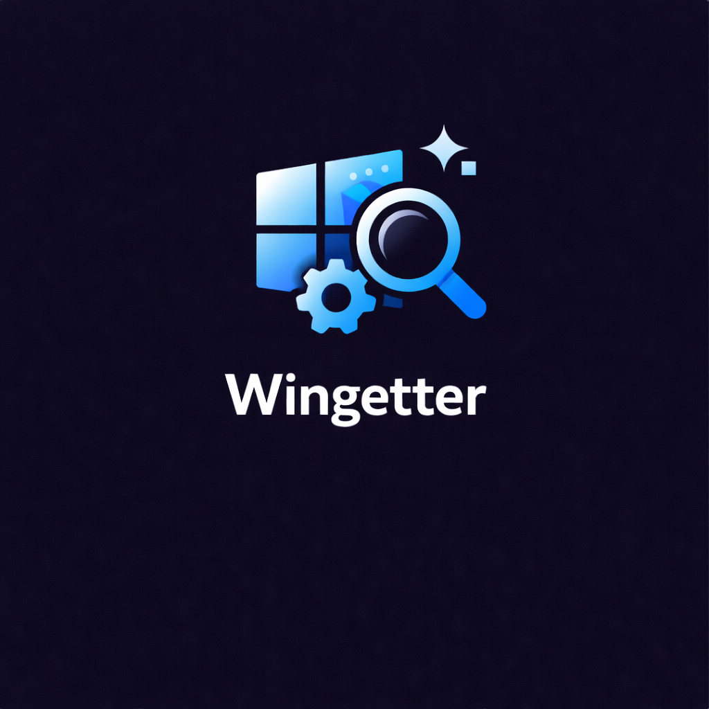
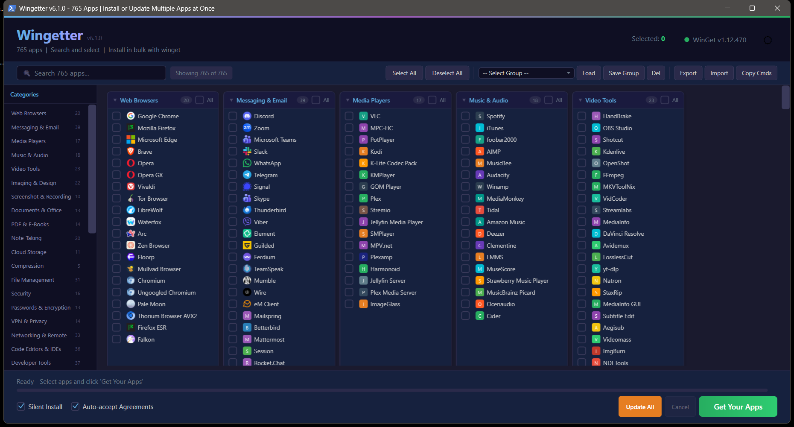

<!-- codex-branding:start -->
<p align="center"></p>

<p align="center">
  
  
  
</p>
<!-- codex-branding:end -->

# Wingetter

A powerful PowerShell GUI application for discovering, selecting, and bulk installing Windows software using [Windows Package Manager (winget)](https://learn.microsoft.com/en-us/windows/package-manager/winget/). Think Ninite, but with 765 apps and full winget integration.


---




## Quick Launch

```powershell
irm "https://raw.githubusercontent.com/SysAdminDoc/Wingetter/main/Wingetter.ps1" | iex
```

Paste the above into any PowerShell window to download and run Wingetter instantly. No installation required.

---

## Features

**765 applications** across **39 categories** with a polished WPF interface:

- **Dark / Light mode** -- defaults to dark, toggle with one click
- **Metadata-rich search** -- ranked local search across names, package IDs, categories, built-in groups, publisher-like ID tokens, installed state, source, scope, update state, and pin state
- **Favicon icons** -- parallel-fetched from app domains with colored letter fallbacks and local caching
- **Bulk install** -- select any combination and install them all in sequence via winget
- **Update mode** -- toggle between Install and Update mode to upgrade already-installed apps
- **Installed app detection** -- background scan prefers `Microsoft.WinGet.Client`, falls back to `winget list`, and caches detected versions under `%APPDATA%\Wingetter`
- **Package trust details** -- click an app to inspect source, publisher, installed/latest version, installer type, URL, SHA256, and metadata warnings
- **WinGet pin controls** -- inspect pin state, add standard/blocking/installed-version pins, remove pins, and opt into pinned updates
- **Silent install & auto-accept agreements** -- toggleable checkboxes for hands-free deployment
- **Copy command** -- grab the raw `winget install` commands to clipboard
- **Save / Load groups** -- persist custom selections as named groups for reuse
- **Export as PS1, Wingetter JSON, or official WinGet JSON** -- generate standalone installer scripts, reusable Wingetter group profiles, or files usable with `winget import`
- **Import JSON profiles** -- load official WinGet export/import JSON, Wingetter group JSON, or simple package ID arrays
- **10 built-in quick-select groups** -- one-click presets for common setups
- **Category sidebar** -- quick-jump navigation panel for all 39 categories
- **Collapsible categories** -- click any category header to collapse/expand
- **Shift-click range selection** -- hold Shift to select a range of apps at once
- **Enhanced tooltips** -- hover to see app name and WingetId
- **Install log panel** -- color-coded per-app results (success/skipped/failed) with summary
- **Structured run logs** -- per-package stdout, stderr, and JSON result records under `%APPDATA%\Wingetter\logs`
- **Migration reports** -- completed install/update runs create exportable Markdown or JSON reports with summary counts, commands, result paths, versions, and sources
- **Toast notifications** -- Windows notification when batch install completes
- **Splash screen** -- loading progress indicator while icons are fetched
- **Select All / Deselect All** per category or globally
- **WinGet auto-detection** -- checks for winget on launch and offers to install it if missing
- **Audited WinGet repair** -- uses App Installer registration and `Microsoft.WinGet.Client` repair with JSONL bootstrap logs instead of raw package downloads

## Built-in Groups

Pre-configured package groups for common use cases:

| Group | Description |
|---|---|
| Essential PC Setup | Chrome, Firefox, 7-Zip, VLC, Notepad++, Everything, and more |
| Web Developer | VS Code, Git, Node.js, Docker, Postman, Windows Terminal |
| Python Developer | VS Code, Git, Python 3.13, Miniconda, PyCharm, DBeaver |
| Creative Suite | GIMP, Krita, Inkscape, Blender, OBS, DaVinci Resolve |
| Gaming PC | Steam, Discord, Epic, GOG, Playnite, Moonlight, Sunshine |
| Privacy & Security | Firefox, Mullvad Browser, Bitwarden, ProtonVPN, VeraCrypt, simplewall |
| System Admin | PowerShell 7, Windows Terminal, WinSCP, PuTTY, Sysinternals |
| Streaming Setup | OBS, Streamlabs, VoiceMeeter, Discord, ShareX, FFmpeg |
| Office & Productivity | LibreOffice, Thunderbird, Bitwarden, Todoist, Obsidian, PDF24 |
| 3D Printing Workshop | Cura, PrusaSlicer, Bambu Studio, OrcaSlicer, FreeCAD, OpenSCAD |

## Categories

| Category | Apps | | Category | Apps |
|---|---:|---|---|---:|
| System Utilities | 54 | | Runtimes & SDKs | 52 |
| Messaging & Email | 39 | | Developer Tools | 37 |
| CLI Tools | 37 | | Code Editors & IDEs | 36 |
| Networking & Remote | 33 | | Hardware & Diagnostics | 32 |
| File Management | 31 | | Gaming | 28 |
| Desktop Customization | 23 | | Video Tools | 23 |
| Imaging & Design | 22 | | Note-Taking | 20 |
| Web Browsers | 20 | | Music & Audio | 18 |
| Media Players | 17 | | Cloud & DevOps | 16 |
| Security | 16 | | Science & Education | 15 |
| Productivity | 14 | | VPN & Privacy | 14 |
| PDF & E-Books | 14 | | Passwords & Encryption | 13 |
| Documents & Office | 13 | | Other | 13 |
| Emulators | 12 | | Audio Production | 11 |
| Cloud Storage | 11 | | AI & LLM Tools | 11 |
| 3D Printing & CAD | 10 | | Screenshot & Recording | 10 |
| Terminals & Shells | 10 | | Backup & Sync | 9 |
| VC++ Redistributables | 8 | | Database Tools | 8 |
| Virtualization | 7 | | Compression | 5 |
| Package Managers | 3 | | | |

## Requirements

- **Windows 10 / 11**
- **PowerShell 5.1+** (ships with Windows 10+)
- **Windows Package Manager (winget)** -- Wingetter will detect and offer to install it if missing
- Internet connection for package installation and icon fetching

## Usage

### Quick Start

```powershell
# Run directly
.\Wingetter.ps1

# Or from anywhere
powershell -ExecutionPolicy Bypass -File "C:\Path\To\Wingetter.ps1"
```

### Workflow

1. Launch the script -- the splash screen loads while icons are fetched
2. Browse categories using the sidebar or use the search bar to find apps
3. Check the boxes for everything you want to install (Shift-click for range selection)
4. Optionally toggle **Silent Install** and **Auto-accept Agreements**
5. Click **Install Selected** to kick off the batch install
6. Review results in the log panel -- color-coded per app
7. Save your selection as a named group for next time, or export it as a standalone PS1/JSON

### Exporting

**Export as WinGet Import JSON** creates an official `winget import` compatible file with `Sources`, `Packages`, and `PackageIdentifier` entries.

**Export as Wingetter Group JSON** creates a portable Wingetter profile that can be imported back into Wingetter on any machine.

**Export as PS1** generates a self-contained PowerShell script that installs your selected packages with no dependencies -- hand it to a coworker or drop it in your deployment pipeline.

**Export Report** becomes available after an install or update run and writes a migration report as Markdown or JSON. The report includes selected packages, status counts, commands, result log paths, installed/available versions, sources, scan timestamps, and import warnings when applicable.

**Import JSON** accepts official WinGet import/export JSON, Wingetter group JSON, or a simple JSON array of package IDs. Packages not present in the Wingetter catalog are reported and skipped during selection.

## Catalog Validation

The repo includes generated catalog snapshots in `catalog/` and validation tools in `tools/`:

```powershell
powershell -NoProfile -ExecutionPolicy Bypass -File .\tools\Sync-EmbeddedCatalog.ps1
powershell -NoProfile -ExecutionPolicy Bypass -File .\tools\Test-Catalog.ps1
powershell -NoProfile -ExecutionPolicy Bypass -File .\tools\Test-ProfileJson.ps1
powershell -NoProfile -ExecutionPolicy Bypass -File .\tools\Test-WinGetRunner.ps1
powershell -NoProfile -ExecutionPolicy Bypass -File .\tools\Test-SearchMetadata.ps1
powershell -NoProfile -ExecutionPolicy Bypass -File .\tools\Test-PackageSources.ps1
powershell -NoProfile -ExecutionPolicy Bypass -File .\tools\Test-VisualAccessibility.ps1
powershell -NoProfile -ExecutionPolicy Bypass -STA -File .\tools\Test-Xaml.ps1
```

`Wingetter.ps1` is the launcher. Runtime code lives in `src/Wingetter.Common.ps1`, `src/Wingetter.Catalog.ps1`, `src/Wingetter.WinGet.ps1`, `src/Wingetter.Groups.ps1`, `src/Wingetter.Sources.ps1`, `src/Wingetter.Ui.ps1`, and `src/Wingetter.App.ps1`. The raw GitHub quick-launch command still works: when a local `src/` directory is not available, the launcher downloads those modules from the configured raw source URL.

`catalog/winget.json` and `catalog/groups.json` are the curation files. `Sync-EmbeddedCatalog.ps1` regenerates the embedded fallback data in the catalog and group modules, and `Test-Catalog.ps1` checks launcher/module parse health, version agreement, unique package IDs, built-in group references, embedded fallback freshness, README counts, and changelog formatting.

## Contributing

Contributions are welcome. To add applications to the database, edit `catalog/winget.json`, run `tools\Sync-EmbeddedCatalog.ps1`, and then run `tools\Test-Catalog.ps1`. Each module fallback entry follows this format:

```powershell
@{ Name = "App Name"; WingetId = "Publisher.PackageName"; Icon = "${f}domain.com" }
```

The `${f}` variable expands to the Google Favicon API prefix. Use the app's primary domain for the best icon match.

## License

MIT

---

Made with PowerShell and too much caffeine.
